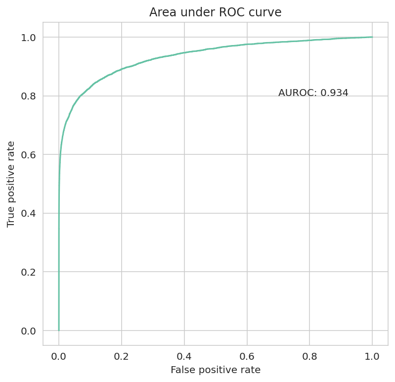

# Credit card fraud detection

Credit card fraud detection on transactional and user data using gradient boosted models.

## Data
Data provided by IEEE Computational Intelligence Society as a part of a [Kaggle competition](https://www.kaggle.com/c/ieee-fraud-detection) was used.

## Notebook description
`notebooks/is_project.ipynb`: Consists of code for preprocessing, feature engineering, training, and evaluation of the model.

## Results
AUROC of 0.934 was achieved on this highly imbalanced dataset.

